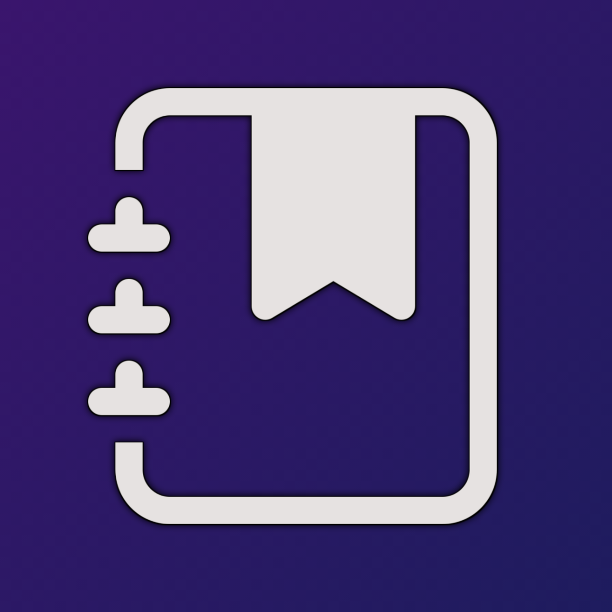
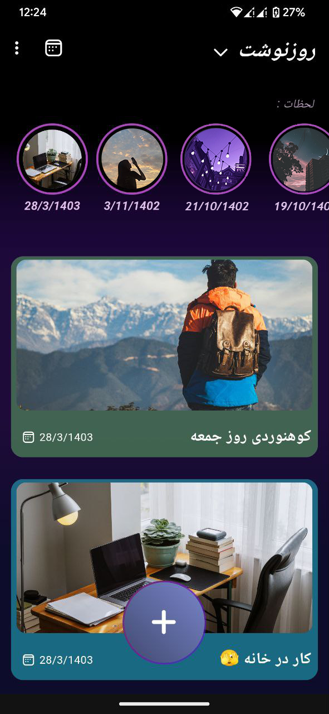
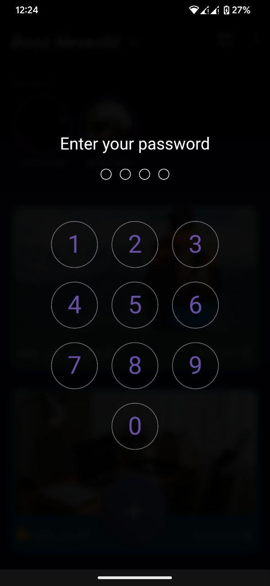

# RoozNevesht

Capture your memories beautifully with this app!

## ✨ Features

- [x] Ability to log your daily notes
- [x] Attractive animations
- [x] Moments (Stories)
- [x] Gallery (View all your journal images)
- [x] Timeline (Display your journal entries by date)

 

## 📸 App Screenshots

|                                   |                                   |                                  |
| --------------------------------- | --------------------------------- |--------------------------------- | 
|   |   |   |

 

## 🔗 Download Links

| Download from GitHub                          |    Download from Myket                               | Download from Cafe Bazaar                          |
| --------------------------------- | --------------------------------- |---------------------------------  |
|  |   |    |
